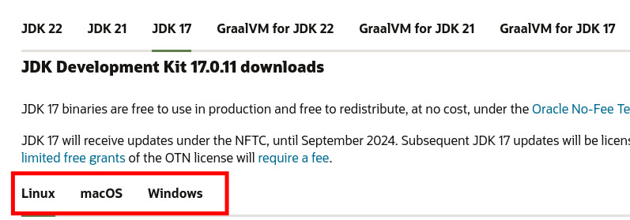
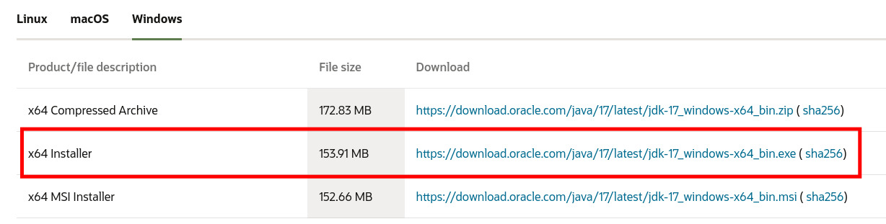

<!--toc:start-->

- [Installing Java 17](#installing-java-17)
- [Installing Prism Launcher](#installing-prism-launcher)
  - [Downloading the Launcher](#downloading-the-launcher)
  - [Logging into your Minecraft account](#logging-into-your-minecraft-account)
- [Using the Modpack](#using-the-modpack)
  - [Using the auto-updating modpack (generic)](#using-the-auto-updating-modpack-generic)
  - [Using the auto-updating modpack (Prismlauncher)](#using-the-auto-updating-modpack-prismlauncher)
  <!--toc:end-->

There are several steps you need to go through in order to start your adventure.
Below are the steps, per our recommendations, at your disposal. You are free to
skip over any steps you deem necessary.

## Installing Java 17

Minecraft 1.20.1 requires Java 17 JDK to be installed on your system.

1. Go to the
   [Oracle Java website](https://www.oracle.com/java/technologies/downloads/#jdk17)
   and pick Java 17\
   

2. Pick your operating system (Windows, macOS, or Linux):\
   

3. Download the installer and run it:\
   

## Installing Prism Launcher

### Downloading the Launcher

1. Go to the [Prism Launcher website](https://prismlauncher.org/) and hit the
   download button:\
   

2. Download the installer and follow its instructions.

### Logging into your Minecraft account

TODO

## Using the Modpack

[releases tab]: https://github.com/StarforgedSMP/Starforged4/releases/latest

There are multiple ways of acquiring the modpack, available for most popular
launchers. See [releases tab] for available formats

### Using the auto-updating modpack (generic)

[packwiz-installer-bootstrap]: https://github.com/packwiz/packwiz-installer-bootstrap/releases/tag/v0.0.3

The recommended way of installing the Starforged4 modpack is using the
auto-updating pack. Regardless of your modlauncher, you may install
`packwiz-installer-bootstrap` from [packwiz-installer-bootstrap]'s releases page
and put it in your instance's `.minecraft` folder. After you confirm
packwiz-installer-bootstrap has been properly installed, you may set the
following as your launch command, and the modpack will be updated for you
automatically.

```bash
java -jar packwiz-installer-bootstrap.jar -g -s both https://starforgedsmp.github.io/Starforged4/packwiz/pack.toml
```

### Using the auto-updating modpack (Prismlauncher)

For those using Prismlauncher, a template has been made available under the
releases tab linked above. Simply import it, and make sure you have placed
packwiz-installer-bootstrap.jar in your instance's `.minecraft` folder.
