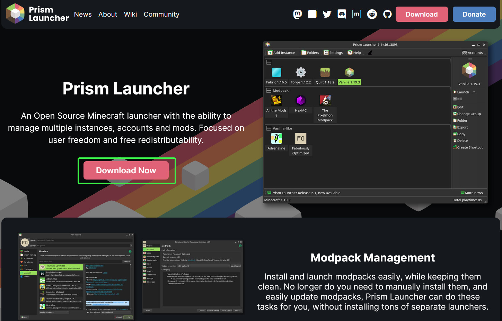

<!--toc:start-->

- [Installing Java 17](#installing-java-17)
- [Installing Prism Launcher](#installing-prism-launcher)
  - [Downloading the Launcher](#downloading-the-launcher)
  - [Logging into your Minecraft account](#logging-into-your-minecraft-account)
- [Using the Modpack](#using-the-modpack)
  - [Using the auto-updating modpack (generic)](#using-the-auto-updating-modpack-generic)
  - [Using the auto-updating modpack (Prismlauncher)](#using-the-auto-updating-modpack-prismlauncher)
  - [Manually installing mods](#manually-installing-mods)
  <!--toc:end-->

There are several steps you need to go through in order to start your adventure.
Below are the steps, per our recommendations, at your disposal. You are free to
skip over any steps you deem necessary.

## Installing Java 17

Minecraft 1.20.1 requires Java 17 JDK to be installed on your system.

1. Go to the
   [Oracle Java website](https://www.oracle.com/java/technologies/downloads/#jdk17)
   and pick Java 17\


2. Pick your operating system (Windows, macOS, or Linux):\


3. Download the installer and run it:\


## Installing Prism Launcher

### Downloading the Launcher

1. Go to the [Prism Launcher website](https://prismlauncher.org/) and hit the
   download button



2. Download the installer for your system architecture (usually x86_64) and run
   the installer. Follow installer's own instructions until you get to the main
   page of the launcher.

### Logging into your Minecraft account

**TODO**

## Using the Modpack

[releases tab]: https://github.com/StarforgedSMP/Starforged4/releases/latest

There are multiple ways of acquiring the modpack, available for most popular
launchers. See [releases tab] for available formats

### Using the auto-updating modpack (generic)

[packwiz-installer-bootstrap]: https://github.com/packwiz/packwiz-installer-bootstrap/releases/tag/v0.0.3

The recommended way of installing the Starforged4 modpack is using the
auto-updating pack. Regardless of your modlauncher, you may install
`packwiz-installer-bootstrap` from [packwiz-installer-bootstrap]'s releases page
and put it in your instance's `.minecraft` folder.

If you are using the classic Minecraft launcher (i.e. Mojang's own) then you can run the following command in
a powershell session while inside your `.minecraft` folder.

```bash
java -jar packwiz-installer-bootstrap.jar -g -s both https://starforgedsmp.github.io/Starforged4/packwiz/pack.toml
```

### Using the auto-updating modpack (Prismlauncher)

For those using Prismlauncher, a template has been made available under the
releases tab linked above. Simply import it, and make sure you have placed
packwiz-installer-bootstrap.jar in your instance's `.minecraft` folder.

### Manually installing mods

Each update to the modpack generates a **generic** pack on the [releases tab]
for your convenience. If you prefer a hands-on approach for your mod management,
or if your launcher of choice simply does not support modded pack formats then
you may follow the instructions below.

1. Get the **generic** pack from the releases tab that is linked above.


2. Open your `.minecraft` folder. The exact instructions for this step will
   differ, but if you are using Mojang's own Minecraft launcher then it will be
   in `%APPDATA%/roaming/.minecraft` For Prismlauncher instances, you can
   rightlick your instance and right-click the "Folder" key in the dropdown menu.

3. Extract `Starforged4-1.20.1-generic.zip` in a location of your choosing. The
   path is arbitrary, so you can extract it anywhere you want.

4. Copy `mods` and `config` directories from the location you have extracted the
   zip to, and paste them in your `.minecraft` folder.

5. Launch the game as usual
